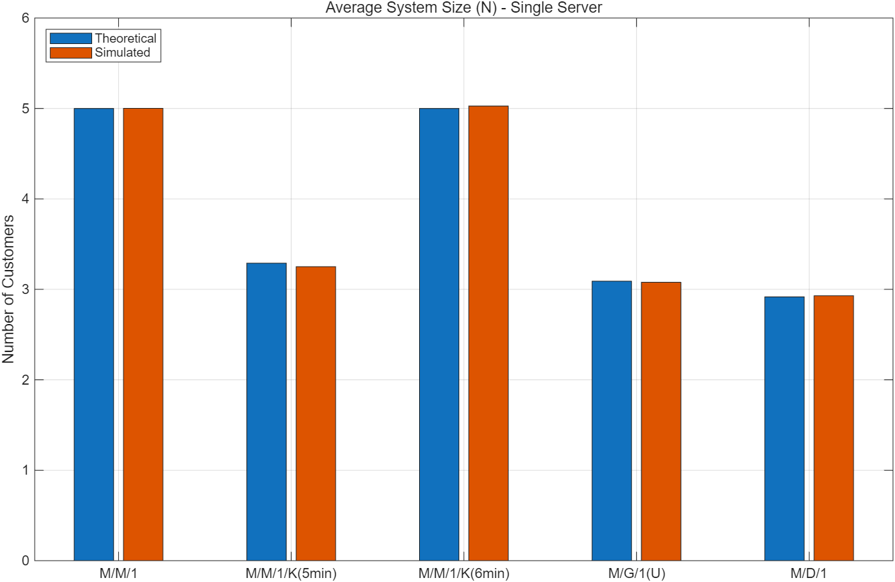
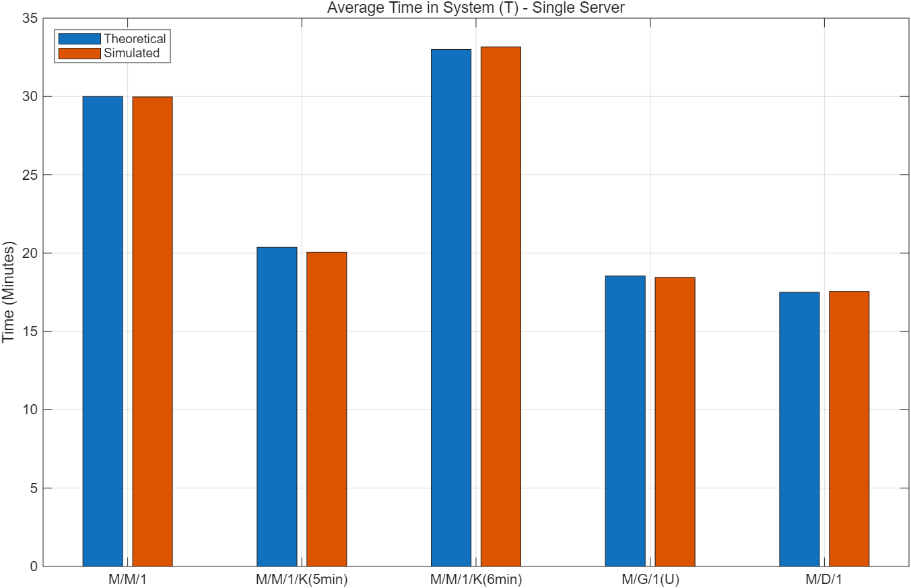
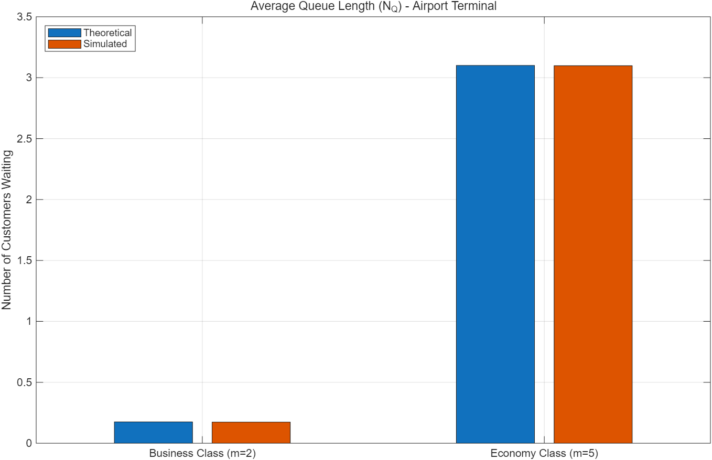
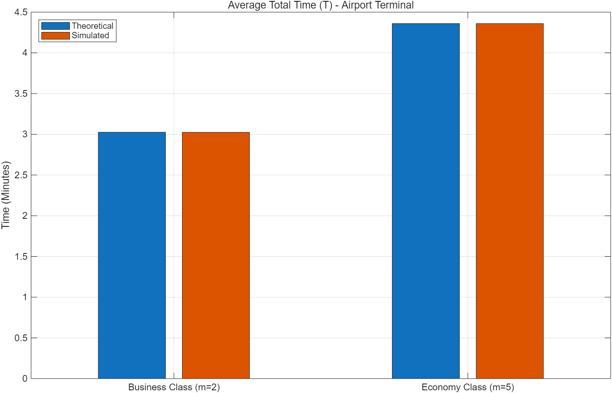

# Queueing System DES Simulator

A MATLAB discrete-event simulator for M/M/1, M/M/1/K, M/G/1, M/D/1, and M/M/m queueing systems with analytical performance validation.

## Overview

This project implements a discrete-event simulation (DES) framework for evaluating the performance of different queueing systems.

Rather than advancing the simulation using fixed time steps, the system is event-driven: the simulation clock advances directly to the next arrival or departure event.

The simulated results are compared with analytical queueing models to validate the implementation.

The main performance metrics are:

- Average number of customers in the system
- Average number of customers waiting in the queue
- Average time spent in the system

## Queueing Models

The simulator supports the following queueing systems:

- **M/M/1** — single server with exponential interarrival and service times
- **M/M/1/K** — single server with finite system capacity
- **M/G/1** — single server with a general service-time distribution
- **M/D/1** — single server with deterministic service time
- **M/M/m** — multiple parallel servers

Different service-time distributions are generated according to the selected queue model.

## Discrete-Event Simulation

The simulation engine maintains the next arrival time and the departure time of each active server.

At each iteration, the simulation clock advances to the earliest scheduled event. The system state is then updated according to whether the event is an arrival or a departure.

The average number of customers in the system is estimated using the time average

$$
\bar{N} = \frac{1}{T}\int_0^T N(t)\,dt
$$

For multi-server systems, the average queue length is similarly estimated as

$$
\bar{N}_Q = \frac{1}{T}\int_0^T \max(0, N(t)-m)\,dt
$$

where \(m\) is the number of servers.

## Analytical Validation

Analytical queueing models are implemented separately from the simulation engine.

Theoretical and simulated results are compared for each queue configuration, allowing the accuracy of the discrete-event simulation to be evaluated quantitatively.

The analytical models include:

- M/M/1 steady-state analysis
- Finite-capacity M/M/1/K analysis
- M/G/1 analysis with uniform service time
- M/D/1 analysis with deterministic service time
- M/M/m multi-server analysis
- Percentage error between analytical and simulated results

## Example Scenario

A multi-server airport service scenario is used to demonstrate the M/M/m model.

Two service classes are considered:

- Business class with 2 servers
- Economy class with 5 servers

Despite having more servers, the economy-class system operates at a higher utilization because of its much larger arrival rate. This results in a longer average queue and a longer average time in the system.

## Project Structure

```text
Queueing-System-DES-Simulator/
├── README.md
├── Main.m
├── simulation.m
└── analysis.m
```

- `Main.m` — defines simulation scenarios, compares theoretical and simulated results, and generates figures
- `simulation.m` — implements the event-driven queueing simulation engine
- `analysis.m` — implements the analytical queueing models

## Results

### Single-Server Queueing Systems

The simulator was evaluated on several single-server queueing models, including **M/M/1**, **M/M/1/K**, **M/G/1**, and **M/D/1**.

The simulated results closely match the corresponding analytical results, which validates the correctness of the discrete-event simulation engine.

#### Average System Size



#### Average Time in System



Several important queueing effects can be observed:

- Compared with **M/M/1**, the **M/M/1/K** systems have smaller average system size and shorter average time in the system because the finite capacity limits congestion.
- The **M/M/1/K (6 min)** case remains stable even when the traffic intensity is close to `1`, since the finite capacity prevents unbounded queue growth.
- Among the infinite-capacity single-server systems, **M/M/1** has the largest average system size and the longest average time, **M/G/1** is intermediate, and **M/D/1** performs the best.
- This shows that queueing performance depends not only on the traffic intensity, but also on the variability of the service-time distribution.

### Multi-Server Airport Terminal Example

A multi-server airport terminal scenario is used to demonstrate the **M/M/m** model.

#### Average Queue Length



#### Average Total Time



Two service classes are considered:

- **Business Class** with `m = 2` servers
- **Economy Class** with `m = 5` servers

Although the economy-class system has more servers, it also has a much higher arrival rate. As a result, its utilization is significantly higher, which leads to a much longer queue and a longer average total time in the system.

### Validation

Across all tested scenarios, the simulated values remain very close to the theoretical results. The small discrepancies are mainly caused by the finite simulation runtime and the randomness of event samples, which is expected in stochastic simulation.

The results show that the discrete-event simulator provides accurate performance estimates for a variety of queueing systems.

## Tools

- MATLAB
- Discrete-Event Simulation
- Queueing Theory
- Stochastic Modelling
- Performance Analysis

## Getting Started

### Requirements

- MATLAB
- Statistics and Machine Learning Toolbox

### Running the Simulation

1. Place `Main.m`, `simulation.m`, and `analysis.m` in the same MATLAB folder.
2. Open the folder in MATLAB.
3. Run `Main.m`.

The program executes the queueing simulations, calculates the corresponding analytical results, reports the percentage errors, and generates comparison figures.
